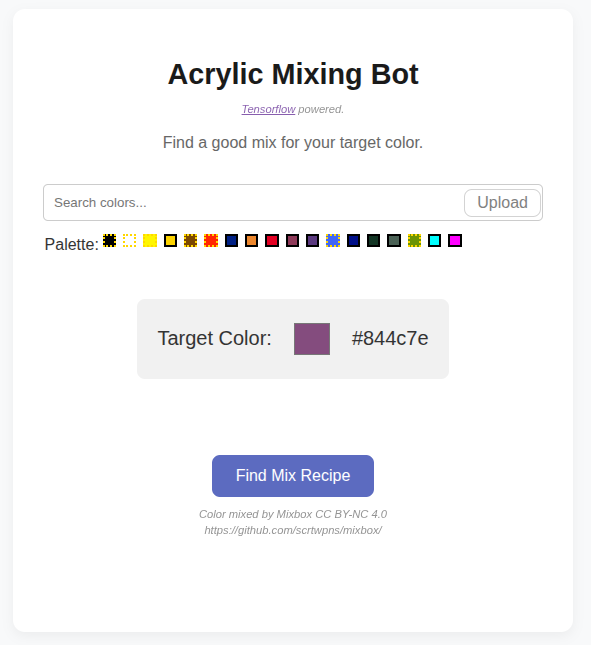

# Tensorflow paint mixing bot

Find a good mix for your target color. See [Demo](https://pascalnoisette.github.io/tensorflow-paint-mixing-bot/).

## Credits

Machine learning by Tensorflow (Apache 2.0) https://github.com/tensorflow/tfjs
Color mixed by Mixbox (CC BY-NC 4.0) https://github.com/scrtwpns/mixbox/
Pigment name by Color-name-list (MIT) https://github.com/meodai/color-names